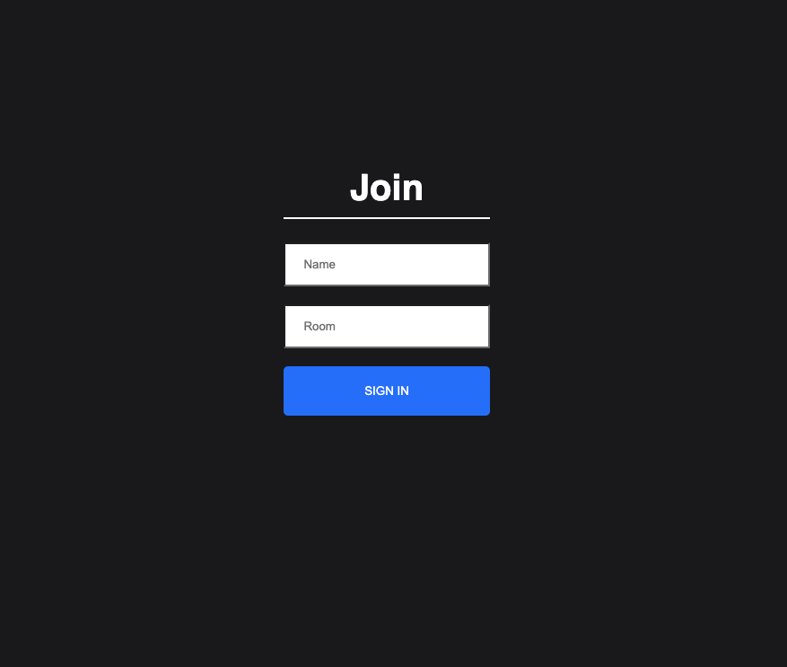
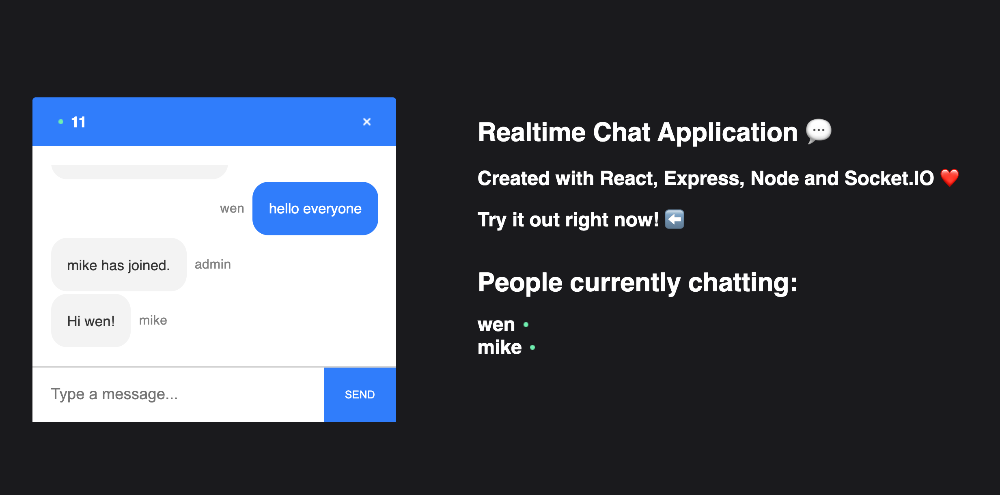

# React Chat App

## Quickstart

`cd server`

`npm run dev`

## Technologies Used
react / socket.io / javascript / node / css / html

## Project Description 
Allows users to join a room and chat with other users in a room using socket.io. Welcome messages to the user and group members happen when new users join or leave. 

** Check out the live app on [Heroku](https://react-chat-app-client.herokuapp.com/)

